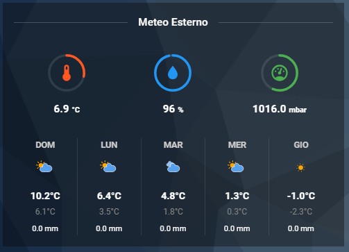

# 🌦️ DomHouse Weather Card

[](https://github.com/hacs/integration)
[]()
[](https://www.domhouse.it)

Una card meteo **"All-in-One"** per Home Assistant Lovelace, progettata per essere elegante, intelligente e facilissima da configurare.

Combina 3 indicatori circolari (Gauges) per i sensori e una lista previsionale meteo a 5 giorni, tutto in un unico componente leggero e senza dipendenze esterne.



---

## ✨ Caratteristiche Principali

* **Zero Dipendenze:** Non richiede l'installazione di altre card (niente `stack-in-card`, `apexcharts`, `mushroom`). È un unico file `.js` autonomo.
* **Editor Visivo Completo:** Configurabile al 100% dall'interfaccia grafica di Home Assistant (UI).
* **Smart Auto-Detect 🧠:** La card "legge" l'unità di misura dei tuoi sensori e configura automaticamente **Icona**, **Colore** e **Scala Min/Max**.
* **Interattività Avanzata (Tap Action) 👆:** Ogni elemento (cerchi e meteo) è cliccabile. Supporta azioni native (`Maps`, `call-service`, `toggle`) e **Browser Mod** (`fire-dom-event`) per popup personalizzati.
* **Modulare:**
    * Se non selezioni un'entità meteo, la sezione previsioni sparisce automaticamente.
    * Se non scrivi un titolo, l'intestazione si nasconde per risparmiare spazio.
* **Animazioni:** Include nativamente le icone meteo animate (SVG).
* **Personalizzabile:** Puoi sovrascrivere manualmente colori, icone e unità di misura per ogni singolo cerchio.

---

## 🚀 Installazione

### Opzione 1: Via HACS (Consigliata)
1.  Apri **HACS** in Home Assistant.
2.  Vai nella sezione **Frontend**.
3.  Clicca sui 3 puntini in alto a destra > **Repository Personalizzati**.
4.  Incolla l'URL di questo repository GitHub: `https://github.com/SalvatoreITA/domhouse-weather-card`
5.  Seleziona la categoria **Lovelace**.
6.  Clicca **Aggiungi** e poi **Scarica**.
7.  Ricarica la pagina del browser.

### Opzione 2: Installazione Manuale
1.  Scarica il file `domhouse-weather-card.js` da questo repository.
2.  Caricalo nella cartella `/www/` del tuo Home Assistant.
3.  Vai in **Impostazioni** > **Plance** > **Risorse**.
4.  Aggiungi una risorsa:
    * URL: `/local/domhouse-weather-card.js`
    * Tipo: `Modulo JavaScript`
5.  Ricarica la pagina del browser.

---

## ⚙️ Configurazione

Puoi aggiungere la card alla tua dashboard in due modi:

### 1. Editor Visivo (UI)
1.  Nella tua dashboard, clicca **Modifica plancia**.
2.  Clicca **Aggiungi Scheda**.
3.  Cerca **"Meteo DomHouse"**.
4.  Usa i menu a tendina per selezionare i tuoi sensori.

### 2. Configurazione YAML (Manuale)
Ecco la lista completa delle variabili disponibili, incluse le nuove azioni al tocco.

| Opzione | Tipo | Descrizione | Default |
| :--- | :--- | :--- | :--- |
| `type` | string | **Obbligatorio.** `custom:domhouse-weather-card` | - |
| `name` | string | Titolo della card. Se omesso, l'intestazione viene nascosta. | - |
| `entity_weather` | string | L'entità meteo (es. `weather.casa`). Se omesso, le previsioni non appaiono. | - |
| `tap_action_weather` | action | Azione al click sulla riga meteo. | `more-info` |
| **CERCHIO 1 (Sinistra)** | | | |
| `entity_temp` | string | Entità per il primo cerchio. | - |
| `temp_icon` | string | Sovrascrivi l'icona. | Auto |
| `temp_color` | string | Sovrascrivi il colore HEX. | Auto |
| `tap_action_1` | action | Azione al click sul Cerchio 1. | `more-info` |
| **CERCHIO 2 (Centro)** | | *(Prefisso `hum_` e `tap_action_2`)* | |
| **CERCHIO 3 (Destra)** | | *(Prefisso `press_` e `tap_action_3`)* | |

---

## 🧠 Legenda Smart Auto-Detect

Se non specifichi colori o icone, la card li sceglie da sola in base all'unità di misura del sensore:

| Unità Sensore | Icona Automatica | Colore | Scala Default | Utilizzo Tipico |
| :--- | :---: | :---: | :--- | :--- |
| **°C / °F / K** | 🌡️ (`home-thermometer`) | 🟠 **Arancione** | -10 a 50 | Temperature |
| **%** | 💧 (`water-percent`) | 🔵 **Blu** | 0 a 100 | Umidità, Batterie |
| **hPa / mbar** | ⏲️ (`gauge`) | 🟡 **Giallo Scuro** | 960 a 1060 | Pressione |
| **W / kW** | ⚡ (`lightning-bolt`) | 🟡 **Giallo** | 0 a 3000 | Consumi, Fotovoltaico |
| **V** | 〰️ (`sine-wave`) | 🟣 **Viola** | 180 a 260 | Voltaggio |
| *Altro* | ⚡ (`flash-circle`) | ⚪ **Grigio** | 0 a 100 | Generico |

---

## 💡 Esempi di Utilizzo

### Esempio 1: Configurazione Completa (Meteo)
La classica visualizzazione con titolo, meteo e 3 sensori climatici.

```yaml
type: custom:domhouse-weather-card
name: "Meteo Casa"
entity_weather: weather.forecast_home
entity_temp: sensor.temperatura_esterna
entity_hum: sensor.umidita_esterna
entity_press: sensor.pressione_assoluta
```

### Esempio 2: Monitor Server (Senza Meteo, Senza Titolo)
Una card compatta per monitorare il tuo sistema Home Assistant o un PC. Rimuovendo entity_weather e name, la card diventa minimalista.

```yaml
type: custom:domhouse-weather-card
# name:  <-- Rimosso per nascondere il titolo
# entity_weather: <-- Rimosso per nascondere le previsioni

# Cerchio 1: Temperatura CPU (Rileva °C -> Arancione)
entity_temp: sensor.processor_temperature

# Cerchio 2: Uso RAM (Rileva % -> Blu)
entity_hum: sensor.memory_use_percent
hum_icon: mdi:memory  # Cambio icona manuale

# Cerchio 3: Potenza assorbita (Rileva W -> Giallo)
entity_press: sensor.server_power

### Esempio 3: Override Manuale (Colori Personalizzati)
Vuoi un cerchio della temperatura Verde invece che Arancione? Ecco come fare.

type: custom:domhouse-weather-card
name: "Stanza da Letto"
entity_weather: weather.forecast_home

entity_temp: sensor.temperatura_camera
temp_color: "#4caf50"      # Forza colore VERDE (HEX)
temp_icon: "mdi:bed"       # Forza icona LETTO
temp_min: 15               # Cambia scala minima
temp_max: 30               # Cambia scala massima

entity_hum: sensor.umidita_camera
entity_press: sensor.quality_air_pm25
```
### Esempio 4: Browser Mod & Popup
Cliccando sul primo cerchio si apre un popup personalizzato

# Azione: Apre Popup Browser Mod
```yaml
tap_action_1:
  action: fire-dom-event
  browser_mod:
    service: browser_mod.popup
    data:
      title: Titolo Popup
      style: |
        --popup-background-color: var(--secondary-background-color);
        --dialog-backdrop-filter: blur(2em) brightness(0.75);
      content:
        type: entities
        entities:
          - entity: switch.xxx
```

### Esempio 4: Navigazione e Toggle
Usare i cerchi come pulsanti rapidi.
```yaml
type: custom:domhouse-weather-card
name: Comandi

# Cerchio 1: Naviga a un'altra pagina
entity_temp: sensor.temp_media
tap_action_1:
  action: navigate
  navigation_path: /lovelace/stanze

# Cerchio 2: Accendi/Spegni Luce
entity_hum: light.luce_sala
hum_icon: mdi:lightbulb
tap_action_2:
  action: toggle
```

## ❤️ Credits
Sviluppato da Salvatore Lentini - DomHouse.it. Basato sul concetto originale di Weather Card ma completamente riscritto con tecnologia LitElement nativa. Le icone meteo animate sono di [Bram Kragten](https://github.com/bramkragten/weather-card)


